# 9. Operator Aritmatika #
```html
document.write("2 + 3 = " + (2 + 3) );
```
Menggunakan document.write untuk menampilkan teks ke halaman.

"2 + 3 = " → teks.

(2 + 3) → operasi penjumlahan (hasil = 5).

Output di layar:
2 + 3 = 5

```html
 document.write("<BR>");
 ```
Menambahkan `<br>` (baris baru) supaya hasil berikutnya ditulis di baris selanjutnya.

```html
 document.write("20 + 3 = " + (20 - 3) );
 ```
Teks: "20 + 3 = " seolah-olah operasi penjumlahan.

Tetapi kode: (20 - 3) → operasi pengurangan (hasil = 17).

Output di layar:
20 - 3 = 17

```html
document.write("<BR>");
```
Membuat baris baru lagi.

```html
document.write("20* 3 = " + (20 * 3) );
```

Menulis teks "20* 3 = " lalu hasil perkalian 20 * 3 = 60.

Output:
20* 3 = 60

```html
document.write("<BR>");
```
Menambahkan baris baru.

```html
document.write("40 / 3 = " + (40 / 3) );
```
Menulis teks "40 / 3 = " lalu hasil pembagian 40 / 3 = 13.3333....

Output:
40 / 3 = 13.333333333333334

```html
 document.write("<BR>");
 ```
Menambahkan baris baru lagi.

# 10. Operator Logika Dan Pembanding #
```html
var nilai = prompt("Nilai (0-100): ", 0);
```
Menampilkan prompt box dengan pesan "Nilai (0-100): ".
0 di akhir adalah nilai default yang muncul di kotak input.
Nilai yang diisi user (misalnya 75) akan disimpan dalam variabel nilai.
Hasil dari prompt adalah string, tapi karena nanti dibandingkan dengan angka (60), JavaScript otomatis mengonversinya ke angka.

```html
var hasil = (nilai >= 60) ? "Lulus" : "Tidak Lulus";
```
Menggunakan operator ternary (? :) untuk percabangan singkat.
Jika kondisi (nilai >= 60) benar → hasil = "Lulus".
Jika kondisi salah → hasil = "Tidak Lulus".
Contoh:
Jika user masukkan 80 → hasil = "Lulus".
Jika user masukkan 45 → hasil = "Tidak Lulus".

```html
document.write("Hasil: " + hasil);
```
Menulis hasil ke halaman web.
Contoh output di browser:
Jika input 80 → Hasil: Lulus
Jika input 45 → Hasil: Tidak Lulus

# Soal Tantangan 1 #
```html
var a = parseInt(27);
document.write("1. " + a + "<BR>");
```
parseInt(27) → karena input angka, hasilnya tetap 27.
Disimpan di variabel a.
document.write menampilkan 1. 27 di halaman, lalu <BR> membuat baris baru.

```html
a = parseInt(27.5);
document.write("2. " + a + "<BR>");
```
parseInt(27.5) → hanya mengambil bagian bilangan bulat di depan → 27.
Output di halaman: 2. 27.

```html
a = parseInt("27A");
document.write("3. " + a + "<BR>");
```
parseInt("27A") → membaca angka di depan (27), lalu berhenti saat bertemu huruf.
Hasil 27.
Output: 3. 27.

```html
a = parseInt("A27.5");
document.write("4. " + a + "<BR>");
```
parseInt("A27.5") → string diawali huruf, jadi tidak bisa dikonversi.
Hasil: NaN (Not a Number).
Output: 4. NaN.

```html
var b = parseFloat(27);
document.write("5. " + b + "<BR>");
```
parseFloat(27) → hasil 27.
Output: 5. 27.

```html
b = parseFloat(27.5);
document.write("6. " + b + "<BR>");
```
parseFloat(27.5) → hasil 27.5 (angka desimal utuh).
Output: 6. 27.5.

```html
b = parseFloat("27A");
document.write("7. " + b + "<BR>");
```
parseFloat("27A") → membaca angka depan 27, berhenti di huruf.
Hasil 27.
Output: 7. 27.

```html
b = parseFloat("A27.5");
document.write("8. " + b + "<BR>");
```
parseFloat("A27.5") → string diawali huruf, tidak bisa dikonversi.
Hasil: NaN.
Output: 8. NaN.

# Soal Tantangan 2 #
```html
var data = ["Ainil", 19, "25 September 2006", "PemrogramanWeb"];
```
Membuat sebuah array bernama data.
Isi array (indeksnya):
1. data[0] = "Ainil" (string → Nama)
2. data[1] = 19 (number → Umur)
3. data[2] = "25 September 2006" (string → Tanggal lahir)
4. data[3] = "PemrogramanWeb" (string → Pelajaran kesukaan)

```html
document.write("Isi array lengkap: " + data + "<BR>");
```
document.write menulis semua isi array sekaligus.
Default, array diubah jadi string dengan koma sebagai pemisah.
Output:
Isi array lengkap: Ainil,19,25 September 2006,PemrogramanWeb

```html
document.write("Nama: " + data[0] + "<BR>");
```
Mengakses elemen array pertama (data[0]).
Output:
Nama: Ainil

```html
document.write("Umur: " + data[1] + "<BR>");
```
Mengakses elemen kedua (data[1] = 19).
Output:
Umur: 19

```html
document.write("Tanggal Lahir: " + data[2] + "<BR>");
```
Mengakses elemen ketiga (data[2] = "25 September 2006").
Output:
Tanggal Lahir: 25 September 2006

```html
document.write("Pelajaran Kesukaan: " + data[3] + "<BR>");
```
Mengakses elemen keempat (data[3] = "PemrogramanWeb").
Output:
Pelajaran Kesukaan: PemrogramanWeb

# Soal Tantangan 3 #
```html
<FORM NAME="calc2">
  Angka 1: <INPUT TYPE="text" NAME="num1"><BR>
  Angka 2: <INPUT TYPE="text" NAME="num2"><BR><BR>

  Pilih Operasi: 
  <SELECT NAME="operasi">
    <OPTION VALUE="+">Penjumlahan (+)</OPTION>
    <OPTION VALUE="-">Pengurangan (-)</OPTION>
    <OPTION VALUE="*">Perkalian (×)</OPTION>
    <OPTION VALUE="/">Pembagian (÷)</OPTION>
  </SELECT><BR><BR>

  <INPUT TYPE="button" VALUE="Hitung" ONCLICK="hitung()"><BR><BR>

  Hasil: <INPUT TYPE="text" NAME="hasil">
</FORM>
```
1. Membuat sebuah form bernama calc2.
2. <INPUT TYPE="text" NAME="num1"> → input pertama untuk angka pertama.
3. <INPUT TYPE="text" NAME="num2"> → input kedua untuk angka kedua.
4. <SELECT NAME="operasi"> ... </SELECT> → dropdown pilihan operasi: tambah, kurang, kali, bagi.
5. <INPUT TYPE="button" VALUE="Hitung" ONCLICK="hitung()"> → tombol “Hitung” yang memanggil fungsi JavaScript hitung().
6. <INPUT TYPE="text" NAME="hasil"> → tempat menampilkan hasil perhitungan.

```html
<SCRIPT LANGUAGE="JavaScript">
  function hitung() {
    var a = parseFloat(document.calc2.num1.value);
    var b = parseFloat(document.calc2.num2.value);
    var op = document.calc2.operasi.value;
    var hasil = 0;

    if(op==="+") hasil = a + b;
    else if(op==="-") hasil = a - b;
    else if(op==="*") hasil = a * b;
    else if(op==="/") hasil = a / b;

    document.calc2.hasil.value = hasil;
  }
</SCRIPT>
```
1. function hitung() { ... } → fungsi yang dijalankan saat tombol “Hitung” diklik.
2. var a = parseFloat(document.calc2.num1.value);
3. Mengambil nilai dari input num1 dalam form calc2.
4. parseFloat mengubah teks menjadi angka desimal.
5. var b = parseFloat(document.calc2.num2.value);
Sama, tapi untuk input kedua.
6. var op = document.calc2.operasi.value;
Mengambil nilai dari dropdown operasi (+, -, *, /).
7. var hasil = 0;
Menyediakan variabel hasil dengan nilai awal 0.
8. Struktur if ... else if memeriksa jenis operasi:
Jika "+" → a + b.
Jika "-" → a - b.
Jika "*" → a * b.
Jika "/" → a / b.
9. document.calc2.hasil.value = hasil;
10. Menampilkan hasil ke kotak teks bernama hasil.

# Soal Tantangan 4 #
```html
<H3>Volume Kubus</H3>
Sisi: <INPUT TYPE="text" ID="sisi">
<INPUT TYPE="button" VALUE="Hitung" ONCLICK="kubus()">
<P ID="hasilKubus"></P>
```
1. Subjudul Volume Kubus.
2. Input teks ID="sisi" → user isi panjang sisi kubus.
3. Tombol Hitung → menjalankan fungsi kubus().
`<P ID="hasilKubus">` → tempat menampilkan hasil perhitungan.

```html
<H3>Volume Balok</H3>
Panjang: <INPUT TYPE="text" ID="panjang">
Lebar: <INPUT TYPE="text" ID="lebar">
Tinggi: <INPUT TYPE="text" ID="tinggi">
<INPUT TYPE="button" VALUE="Hitung" ONCLICK="balok()">
<P ID="hasilBalok"></P>
```
1. Subjudul Volume Balok.
2. Input teks panjang, lebar, tinggi untuk dimensi balok.
3. Tombol Hitung → memanggil fungsi balok().
4. `<P ID="hasilBalok">` → menampilkan hasil volume balok.

```html
<H3>Volume Tabung</H3>
Jari-jari: <INPUT TYPE="text" ID="jari">
Tinggi: <INPUT TYPE="text" ID="tinggiTabung">
<INPUT TYPE="button" VALUE="Hitung" ONCLICK="tabung()">
<P ID="hasilTabung"></P>
```
1. Subjudul Volume Tabung.
2. Input teks jari untuk jari-jari alas.
3. Input teks tinggiTabung untuk tinggi tabung.
4. Tombol Hitung → memanggil fungsi tabung().
5. `<P ID="hasilTabung">` → menampilkan hasil volume tabung.

```html
<SCRIPT LANGUAGE="JavaScript">
  function kubus(){
    var s = parseFloat(document.getElementById("sisi").value);
    var volume = s * s * s;
    document.getElementById("hasilKubus").innerHTML = "Volume kubus = " + volume;
  }
  function balok(){
    var p = parseFloat(document.getElementById("panjang").value);
    var l = parseFloat(document.getElementById("lebar").value);
    var t = parseFloat(document.getElementById("tinggi").value);
    var volume = p * l * t;
    document.getElementById("hasilBalok").innerHTML = "Volume balok = " + volume;
  }
  function tabung(){
    var r = parseFloat(document.getElementById("jari").value);
    var t = parseFloat(document.getElementById("tinggiTabung").value);
    var phi = 3.14;
    var volume = phi * r * r * t;
    document.getElementById("hasilTabung").innerHTML = "Volume tabung = " + volume;
  }
</SCRIPT>
```
1. Fungsi kubus()
Ambil nilai sisi.
Hitung s * s * s.
Tampilkan hasil ke <P ID="hasilKubus">.

2. Fungsi balok()
Ambil nilai panjang, lebar, tinggi.
Hitung p * l * t.
Tampilkan ke <P ID="hasilBalok">.

3. Fungsi tabung()
Ambil nilai jari dan tinggiTabung.
Gunakan rumus volume tabung: π × r² × t (dengan π ≈ 3.14).
Tampilkan ke <P ID="hasilTabung">.

# Hasil Output Semuanya #
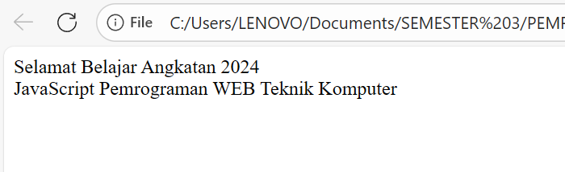
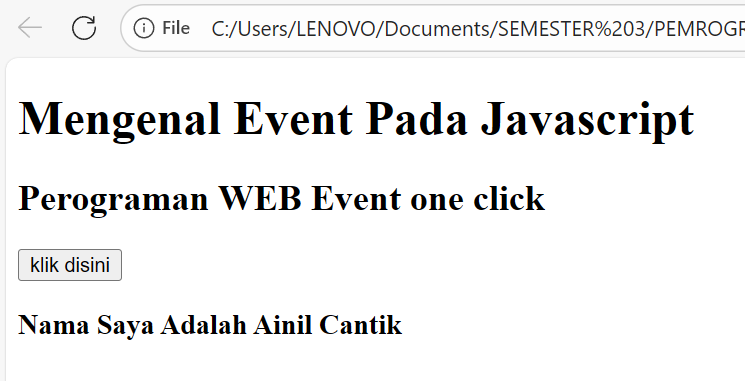

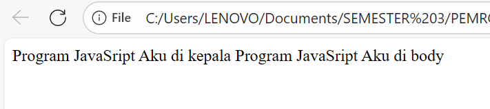
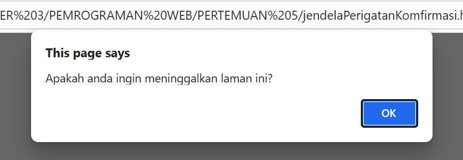
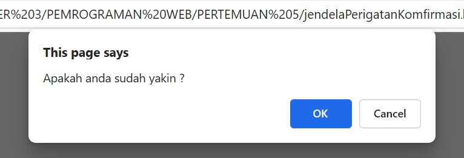
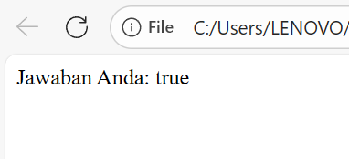

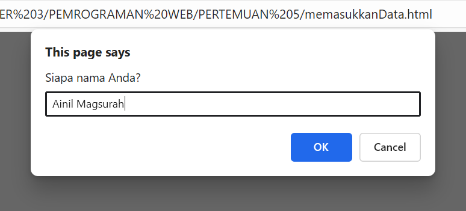
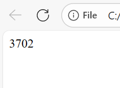
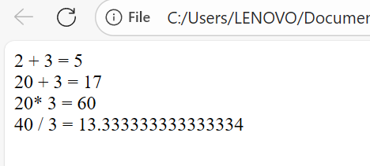
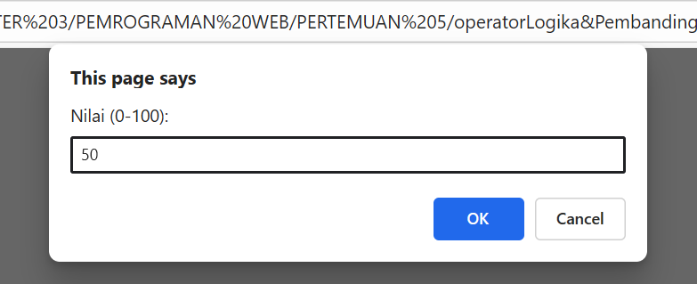
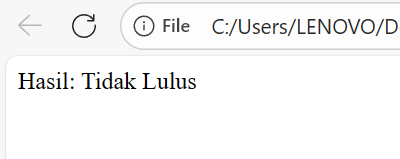
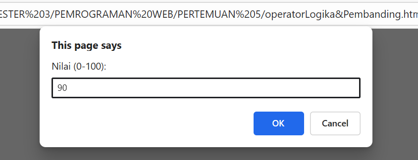
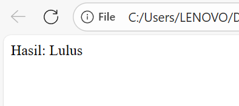
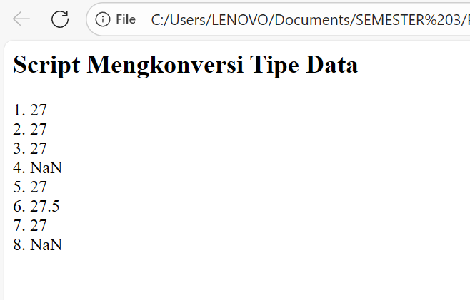
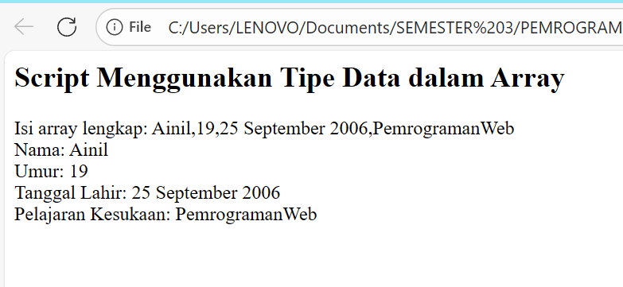
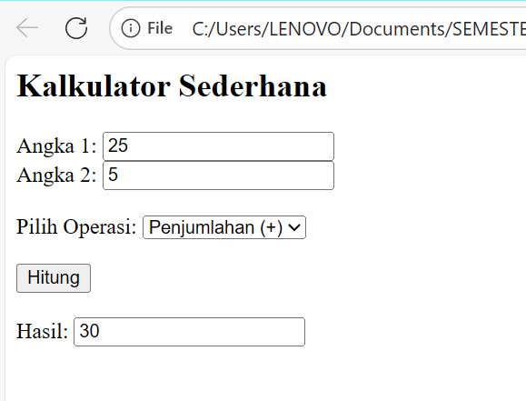
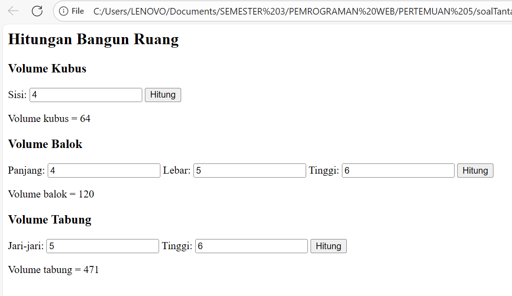